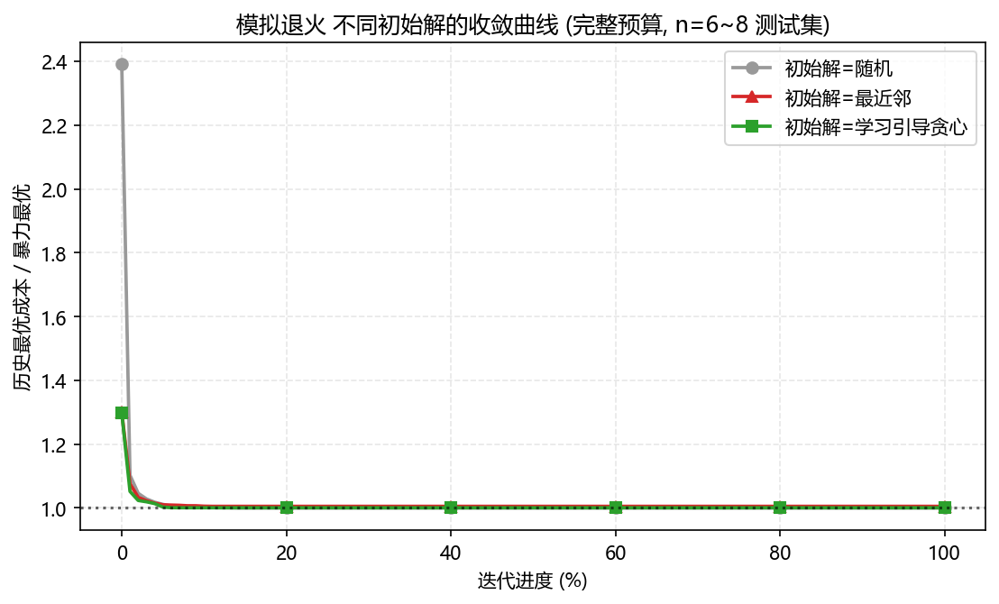
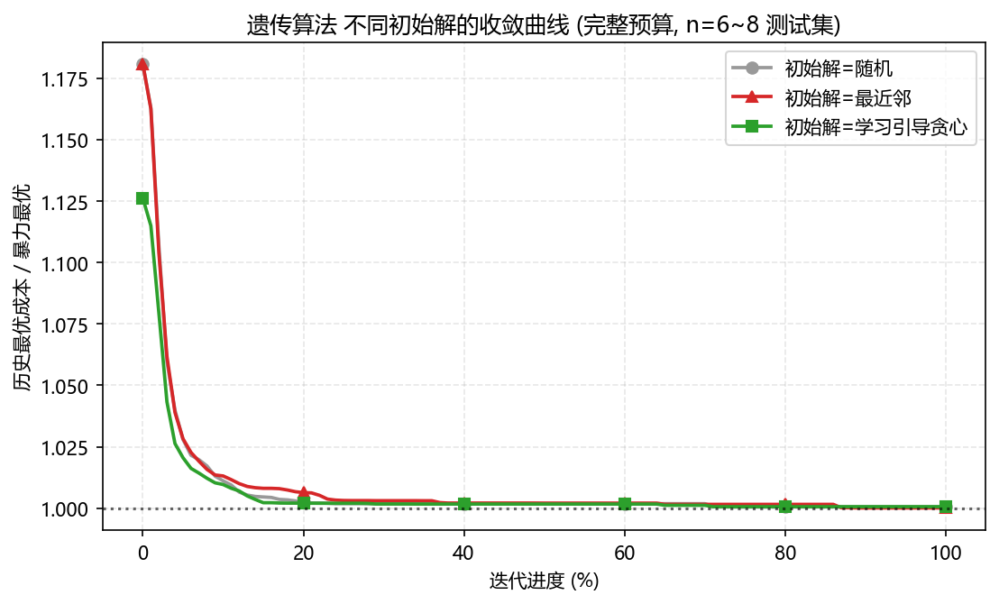
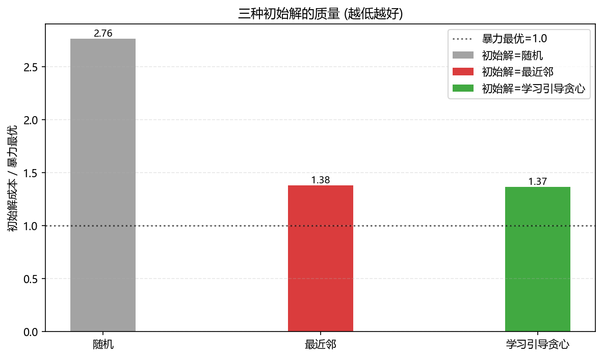
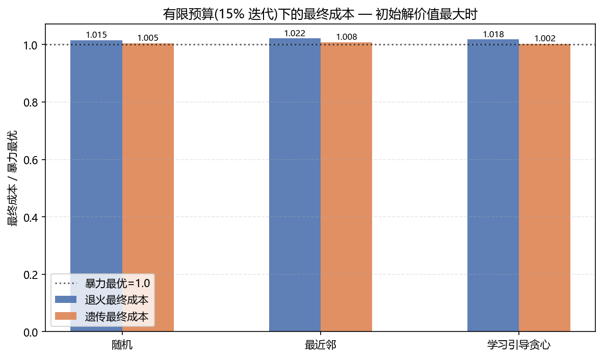

# 实验报告 2: Learning to Optimize — 学习引导贪心初始化

> 生成时间: 2026-09-01 10:40  ·  全部种子固定可复现

## 1. 方法

一句话: **用暴力最优解当"专家轨迹", 学一个任务打分器, 用它引导贪心构造初始解。**

1. **监督数据**: 随机生成 n≤8 的小实例, 全排列枚举求出全局最优路线(专家);

2. **行为克隆**: 把专家路线拆成一步步决策。每步状态 + 每个候选任务的 13 维特征(`travel、wait、window_width、window_slack、late_overdue、deadline_overdue、has_fixed、has_window、has_deadline、priority、duration、remaining_count、avg_dist_others`), 标签=该步的最优选择;

3. **打分器**: 随机森林二分类, 输出"这个任务像不像最优下一步";

4. **学习引导贪心**: 每步选模型分最高的任务, 模型对谁都拿不准(<0.5)时退化为最近邻;代码里另附束搜索版 `learned_beam`(学习先验 + 精确剪枝);

5. **应用**: 对比三种初始解(随机 / 最近邻 / 学习引导贪心)喂给模拟退火/遗传算法, 分别在完整预算和有限预算(15% 迭代)下比最终成本与收敛速度。

## 2. 训练数据

| 规模 n | 实例数 |
|---|--:|
| 4 | 120 |
| 5 | 120 |
| 6 | 120 |
| 7 | 80 |
| 8 | 24 |

共 464 个实例, 拆出 8624 条逐步决策样本; 按实例 8:2 切分训练/测试。

## 3. 学到的打分器准不准

- 测试集"下一步选择"Top-1 准确率: **81.5%**(随机猜约 1/n)。

- 纯贪心 rollout(每步选最高分)初始成本 / 暴力最优: 随机 2.78, 最近邻 1.38, 学习贪心 1.37。

- 贪心 rollout 已能追平甚至超过最近邻; 若想更强可上束搜索版(见代码注释)。

## 4. 收敛曲线(完整预算)

横轴是迭代进度(0~100%), 纵轴是历史最优成本/暴力最优, 越早压到 1 说明收敛越快。

## 5. 成本对比

| 初始解类型 | 初始成本/最优 | 退火最终/最优 | 遗传最终/最优 | 退火AUC | 遗传AUC |
| --- | --- | --- | --- | --- | --- |
| 随机 | 2.763 | 1.000 | 1.001 | 201.309 | 137.367 |
| 最近邻 | 1.378 | 1.005 | 1.000 | 201.535 | 137.495 |
| 学习引导贪心 | 1.366 | 1.001 | 1.001 | 200.543 | 137.150 |

## 6. 有限预算(15% 迭代): 初始解价值最大时

| 初始解类型 | 退火最终/最优 | 遗传最终/最优 |
| --- | --- | --- |
| 随机 | 1.015 | 1.005 |
| 最近邻 | 1.022 | 1.008 |
| 学习引导贪心 | 1.018 | 1.002 |
预算砍到 15% 后, 好初始解的收益被放大: 学习引导贪心让退火/遗传在"算不动"时也能从更好的起点出发。

## 7. 结论

- 初始解质量: 学习引导贪心 1.37×最优 vs 最近邻 1.38×最优(行为克隆 + 最近邻兜底, 已追平/略优)。

- 有限预算下退火最终成本: 学习型 1.018×最优 vs 最近邻 1.022×最优; 收敛 AUC 也更小——预算紧张时, 好起点就是好结果。

- **面试金句**: "传统优化保证最优性, 学习提供先验; 行为克隆用暴力最优当专家, 学到的贪心策略已经追平人工设计的启发式——这就是 Learning to Optimize 的落地版。"

## 8. 可复现

- `python learn_init.py` 重跑; 训练实例缓存于 `experiment/data/l2o_train_instances.json`(带规模签名)。
