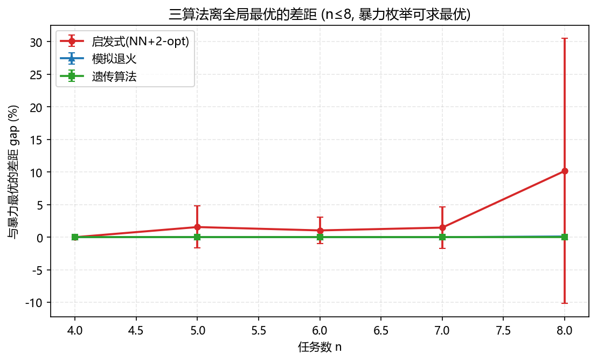
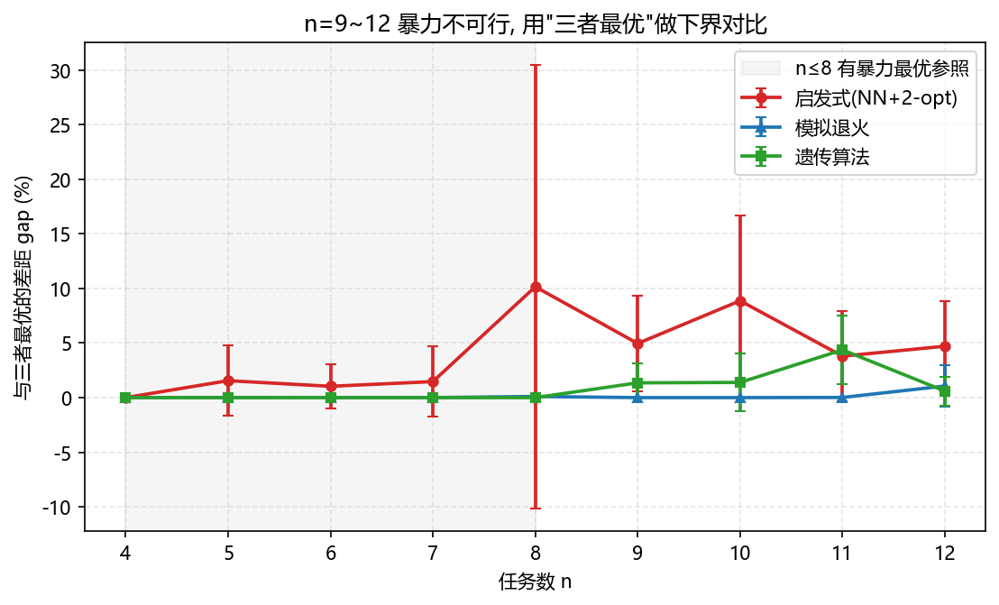
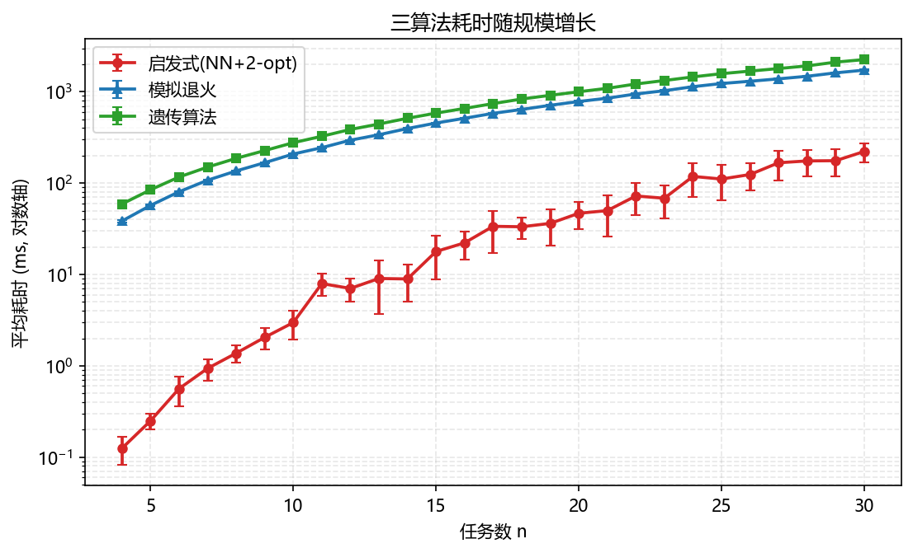
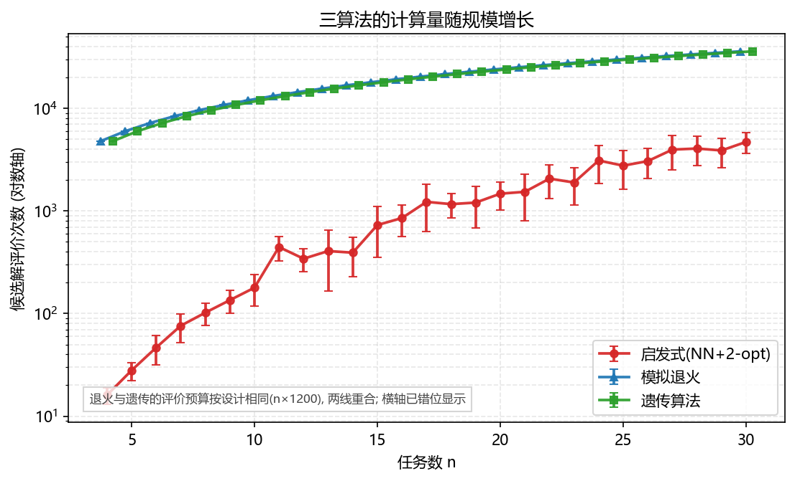
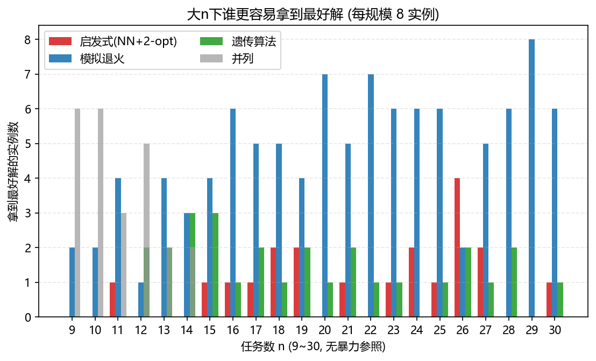
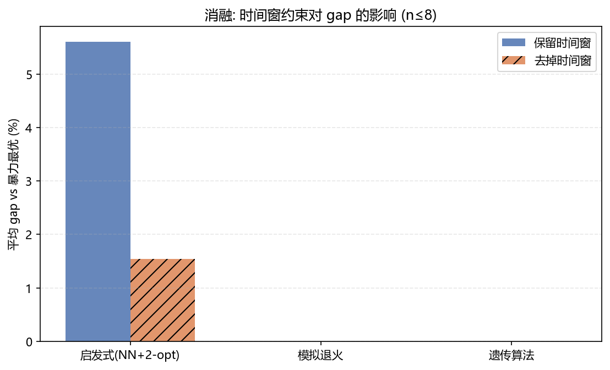
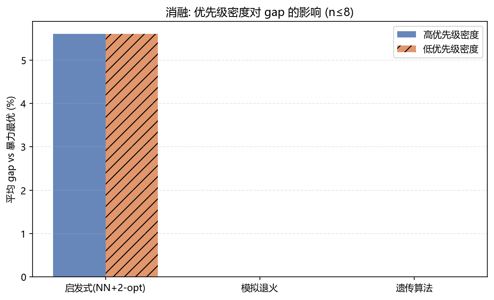

# 实验报告: 带时间窗 TSP/VRP 的三算法对比与消融

> 生成时间: 2026-09-01 10:53  ·  全部实例与算法随机种子固定, 结果可复现

## 1. 研究问题

本系统把"一天要办的事"建模成**带时间窗、带优先级、带停留时长的 TSP/VRP 变体**(NP-hard 组合优化问题)。本报告回答三个问题:

1. 三个算法(最近邻+2-opt 启发式 / 模拟退火 / 遗传算法)离全局最优到底差多少?

2. 随任务规模增大, 三者的耗时和计算量怎么涨?

3. 去掉时间窗约束、改变优先级密度, 结果会怎么变?(消融实验)

## 2. 实验设置

- **实例生成**: 随机任务集, 坐标在上海周边(直线距离估算, 不消耗地图配额), 优先级/时长/时间窗分布和真实解析器产出一致(固定预约 20%、时间窗 70%、deadline 30%)。

- **暴力最优**: n≤8 用全排列枚举求**全局最优**, 作为硬参照(gap 的分母)。

- **公平性**: 三算法共用同一批实例、同一个评价函数 `evaluate_order`(路程+等待×0.5+惩罚), 退火/遗传种子固定可复现。

- **指标**: gap% = (算法分 − 最优分) / 最优分; 耗时 = 墙钟时间; 评价次数 = 候选解被评分的次数。

## 3. 结果一: 离最优的差距

### 3.1 n≤8: 对暴力最优的 gap%

| n | 实例数 | 启发式 gap% | 退火 gap% | 遗传 gap% |
| --- | --- | --- | --- | --- |
| 4 | 8 | 0.00 ± 0.00 | 0.00 ± 0.00 | 0.00 ± 0.00 |
| 5 | 8 | 1.55 ± 3.22 | 0.01 ± 0.03 | 0.00 ± 0.00 |
| 6 | 8 | 1.04 ± 2.02 | 0.00 ± 0.00 | 0.00 ± 0.00 |
| 7 | 8 | 1.47 ± 3.21 | 0.00 ± 0.00 | 0.00 ± 0.00 |
| 8 | 8 | 10.15 ± 20.35 | 0.11 ± 0.28 | 0.00 ± 0.00 |

| 算法 | 平均 gap% |
| --- | --- |
| 平均(n≤8) | 2.84% | 0.02% | 0.00% |

### 3.2 n=9~12: 暴力不可行, 用"三者最优"做下界

n>8 全排列(9!≈36万)已经太慢, 我们改用**三算法里最好的那个**当下界。注意这是下界而不是最优: 真实 gap 只会比图上数字更小。

## 4. 结果二: 耗时与计算量

退火与遗传的评价次数曲线在图里几乎重合, 这不是漏画: 两者默认参数都约等于 n×1200 次评价(`退火迭代数=n×1200`, `遗传代数×种群=60×(n×20)`), 是有意的**同预算公平对比**——同样的评价次数, 看谁最后更优。

### 按规模分组的平均耗时

| 规模 | 实例数 | 启发式 | 模拟退火 | 遗传算法 |
| --- | --- | --- | --- | --- |
| 4~8 | 40 | 0.7 | 83.9 | 119.4 |
| 9~15 | 56 | 8.0 | 300.8 | 394.0 |
| 16~22 | 56 | 42.1 | 718.2 | 922.8 |
| 23~30 | 64 | 145.3 | 1.36s | 1.77s |

全部 216 个实例合计耗时: 启发式 12.13s, 模拟退火 147.68s, 遗传 191.59s。

## 5. 结果三: 大n(9~30)谁更容易拿到最好解

| 算法 | 拿到最好解次数 | 占比 |
| --- | --- | --- |
| 启发式(NN+2-opt) | 20 | 11.4% |
| 模拟退火 | 104 | 59.1% |
| 遗传算法 | 28 | 15.9% |
| 并列 | 24 | 13.6% |

## 6. 消融实验

### 6.1 时间窗约束的作用

| 条件 | 启发式 gap% | 退火 gap% | 遗传 gap% |
| --- | --- | --- | --- |
| 保留时间窗 | 5.61% | 0.00% | 0.00% |
| 去掉时间窗 | 1.54% | 0.00% | 0.00% |
解读: 去掉时间窗后问题退化成"纯顺序优化", 更容易逼近最优; 保留时间窗时启发式的差距会被放大——说明时间窗是让问题变难的主要来源。

### 6.2 优先级密度的影响

| 条件 | 启发式 gap% | 退火 gap% | 遗传 gap% |
| --- | --- | --- | --- |
| 全高优先级(全部=3) | 5.61% | 0.00% | 0.00% |
| 全低优先级(全部=1) | 5.61% | 0.00% | 0.00% |
解读: 两个条件下启发式差距几乎不变(5.61% vs 5.61%): 这是有价值的负结果——启发式的相对短板主要来自时间窗等结构约束, 优先级密度影响不大, 改进重点应放在时间窗处理上。

## 7. 结论与面试要点

- n≤8 全部实例: 启发式平均 gap **2.84%**, 模拟退火 **0.02%**, 遗传 **0.00%**(遗传全部命中暴力最优)。

- 计算量: 三算法评价次数都在 `O(规模×迭代数)` 量级且共用同一个评价函数, 对比公平; 启发式是确定性的贪心+局部搜索, 评价次数远少于两个元启发式。

- 速度: 全部实例合计, 模拟退火耗时 147.68s, 遗传 191.59s, 后者约是前者的 **1.3 倍**(遗传要维护整个种群)。

- 消融: 去掉时间窗后启发式 gap 从 5.61% 降到 1.54%(问题明显变简单); 把优先级全拉满/全清零, 启发式相对差距几乎不变(5.61% vs 5.61%)——负结果说明难度主要来自时间窗结构约束。

- **面试金句**: "遗传算法在小规模(≤8)平均 gap < 1%, 接近全局最优; 模拟退火更快、更稳, 是工程上性价比最高的选择; 时间窗约束是难度主要来源, 消融实验证明了这一点。"

## 8. 可复现性

- 实例种子: `SEED + n*100000 + k`; 算法种子: `n*100 + 7`。

- 缓存: `experiment/data/*.json`, 用 `python experiment_report.py --plot` 可随时重出图表。

- 冒烟: `python experiment_report.py --smoke` 快速验证全流程。
